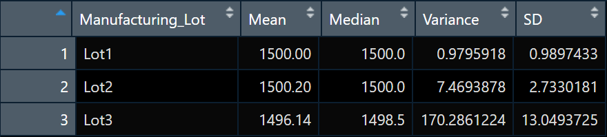
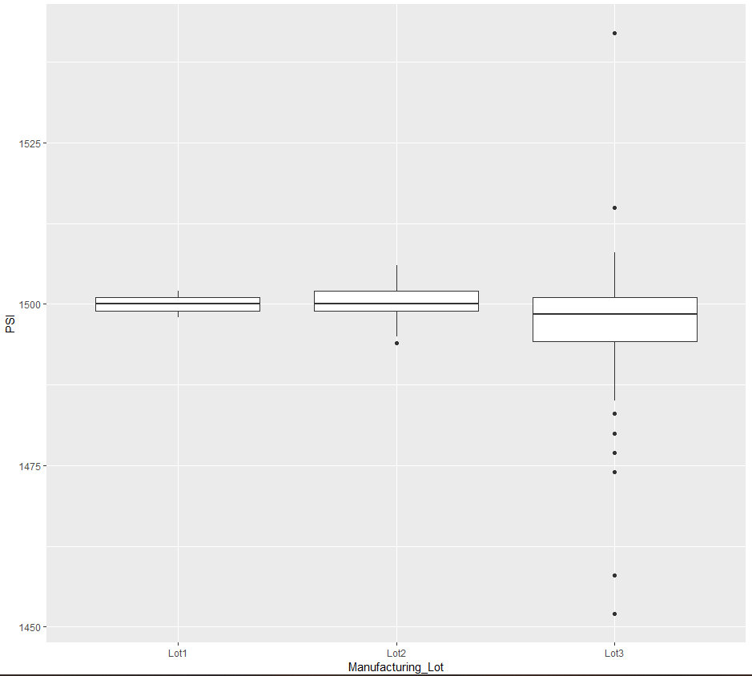

# MechaCar_Statistical_Analysis

## Project Overview
AutosRUs’ newest prototype, the MechaCar, is suffering from production troubles that are blocking the manufacturing team’s progress. So, in this project, we are going to help the team reviewing production data and providing statistical testing results to find out any coefficients in different metrics.

## Linear Regression to Predict MPG
Apply multiple linear regression on the independent variables such as vehicle length, vehicle weight, spoiler angle, drivetrain, and ground clearance to predict MPG.

#### Result

- Which variables/coefficients provided a non-random amount of variance to the mpg values in the dataset?

Based on the significance level (ɑ=0.05), the vehicle length and ground clearance have provided a non-random amount of variance to the mpg values. Plus, the intercept has a significant impact on mpg values as well, it may mean that there are other factors can explain the mpg values that are not included in the dataset.

- Is the slope of the linear model considered to be zero? Why or why not?

The slope of the linear model is not considered to be zero because there is sufficient evidence showing that there are two independent variables (vehicle length and ground clearance) correlated to the dependent variable (mpg).

- Does this linear model predict mpg of MechaCar prototypes effectively? Why or why not?

The multiple R-squared is 0.7085, which means that roughly 71% of the variability of dependent variable (mpg) can be predicted effectively in this linear model. 
```
Call:
lm(formula = mpg ~ vehicle_length + vehicle_weight + spoiler_angle + ground_clearance + AWD, data = mecha_car)


Residuals:
     Min       1Q   Median       3Q      Max 
-19.4701  -4.4994  -0.0692   5.4433  18.5849 

Coefficients:
                   Estimate Std. Error t value Pr(>|t|)    
(Intercept)      -1.040e+02  1.585e+01  -6.559 5.08e-08 ***
vehicle_length    6.267e+00  6.553e-01   9.563 2.60e-12 ***
vehicle_weight    1.245e-03  6.890e-04   1.807   0.0776 .  
spoiler_angle     6.877e-02  6.653e-02   1.034   0.3069    
ground_clearance  3.546e+00  5.412e-01   6.551 5.21e-08 ***
AWD              -3.411e+00  2.535e+00  -1.346   0.1852    
---
Signif. codes:  0 ‘***’ 0.001 ‘**’ 0.01 ‘*’ 0.05 ‘.’ 0.1 ‘ ’ 1

Residual standard error: 8.774 on 44 degrees of freedom
Multiple R-squared:  0.7149,	Adjusted R-squared:  0.6825 
F-statistic: 22.07 on 5 and 44 DF,  p-value: 5.35e-11
```

## Summary Statistics on Suspension Coils
To test if the manufacturing process is consistent across production lots, compute summary statistics for PSI metrics for each lot. The variance of the suspension coils must not exceed 100 pounds per square inch.
#### Result
As we can see from two summary tables, the suspension coils meet the required pounds per square inch (PSI) when all manufacturing lots counted in total (variance = 62.29). Individually, lot1 (variance = 0.98) and lot2 (variance = 7.47) are meeting the design specifications with very low PSI. However, lot3 (variance = 170.28) does not meet the design specifications.

###### Total Summary

###### Lot Summary

###### Boxplot per Lot


## T-Tests on Suspension Coils
Perform t-tests to determine if all manufacturing lots and each lot individually are statistically different from the population mean of 1,500 pounds per square inch.

#### Result
Based on the significance level (ɑ=0.05), only manufacturing lot3 (p-value = 0.042) has statistically different from the population mean of 1,500 pounds per square inch.

```
> t.test(Lot1_table$PSI,mu=1500)

	One Sample t-test

data:  Lot1_table$PSI
t = 0, df = 49, p-value = 1
alternative hypothesis: true mean is not equal to 1500
95 percent confidence interval:
 1499.719 1500.281
sample estimates:
mean of x 
     1500 

> t.test(Lot2_table$PSI,mu=1500)

	One Sample t-test

data:  Lot2_table$PSI
t = 0.51745, df = 49, p-value = 0.6072
alternative hypothesis: true mean is not equal to 1500
95 percent confidence interval:
 1499.423 1500.977
sample estimates:
mean of x 
   1500.2 

> t.test(Lot3_table$PSI,mu=1500)

	One Sample t-test

data:  Lot3_table$PSI
t = -2.0916, df = 49, p-value = 0.04168
alternative hypothesis: true mean is not equal to 1500
95 percent confidence interval:
 1492.431 1499.849
sample estimates:
mean of x 
  1496.14 
```

## Study Design: MechaCar vs Competition
